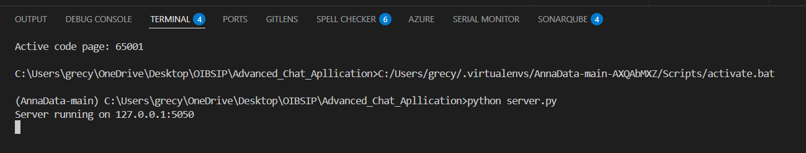
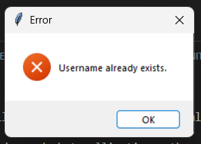

# 💬 Advanced Chat Application

## 📌 Internship Project - OIBSIP

This project is a multi-client chat application developed using Python.
It follows a client-server architecture and includes user authentication, chat rooms, message history storage, and duplicate login prevention.

---

## 🚀 Features

- 🔐 User Registration & Login
- 🔒 Secure Password Hashing (SHA-256)
- 🚫 Duplicate User Login Prevention
- 🏠 Multiple Chat Rooms
- 💾 SQLite Database Integration
- 🕒 Timestamped Messages
- 📜 Automatic Message History Loading
- 🖥 Graphical User Interface (Tkinter)
- 🔄 Multi-client Support using Socket Programming

---

## 🛠 Technologies Used

- Python
- Socket Programming
- Tkinter (GUI)
- SQLite3 Database
- Hashlib (Security)
- Multithreading

---

## 📂 Project Structure

```
Advanced_Chat_Application/
│
├── server.py
├── client.py
├── chat_database.db  (auto-created)
├── requirements.txt
├── README.md
└── screenshots/
    ├── server.png
    ├── client_register.png
    ├── chat_apllication.png
    └── duplicate_user.png
```

---

## ⚙️ How to Run the Project

### Step 1: Start the Server

```
python server.py
```

### Step 2: Start the Client (Open New Terminal)

```
python client.py
```

### Step 3: Register or Login
- Choose LOGIN or REGISTER
- Enter username and password
- Enter chat room name
- Start chatting

You can open multiple clients to simulate multiple users.

---

## 🗄 Database Schema

### Users Table
- id
- username
- password (hashed using SHA-256)

### Messages Table
- id
- username
- room
- message
- timestamp

---

## 📸 Screenshots

### 🖥 Server Running


---

### 🔐 User Registration


---

### 💬 Chat Application Interface


---

### 🚫 Duplicate Login Prevention


---

## 🎓 Learning Outcomes

- Understanding Client-Server Architecture
- Implementing Socket Programming
- Managing Multi-threading
- Integrating SQLite Database
- Securing Passwords using Hashing
- Designing GUI Applications
- Implementing Authentication Systems

---

## 👩‍💻 Developed By

Gracy
OIBSIP Internship Project