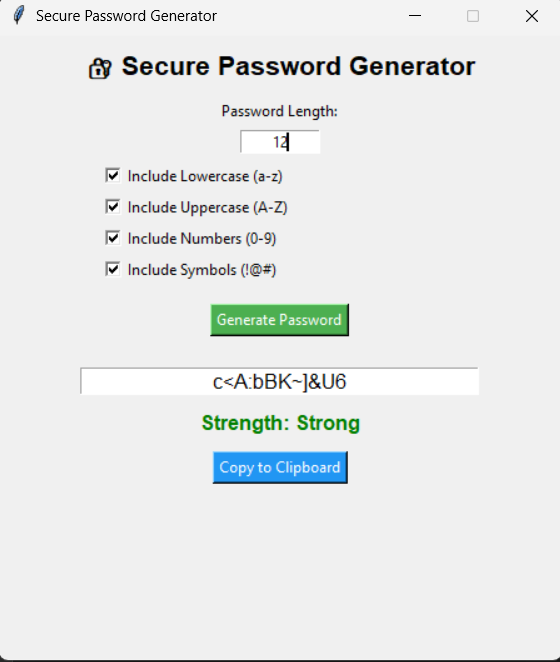

# 🔐 Secure Password Generator

An advanced GUI-based password generator developed using Python and Tkinter.
This application allows users to generate strong, customizable, and secure passwords based on selected security criteria.

Developed as part of the AICTE Oasis Infobyte Python Development Internship.

---

## 🚀 Features

- Generate secure passwords using Python's `secrets` module
- Custom password length selection
- Include or exclude:
  - Lowercase letters (a-z)
  - Uppercase letters (A-Z)
  - Numbers (0-9)
  - Symbols (!@#$%^&*)
- Automatically excludes confusing characters (0, O, 1, l, I)
- Password strength indicator (Weak / Medium / Strong)
- Clipboard integration (Copy password instantly)
- User-friendly GUI built with Tkinter
- Input validation and proper error handling

---

## 🛡 Security Implementation

This application uses Python's built-in `secrets` module instead of the `random` module to ensure cryptographically secure password generation.

Password strength is evaluated based on:
- Length of the password
- Inclusion of uppercase, lowercase, digits, and symbols
- Overall character diversity

---

## 🖥 Technologies Used

- Python 3.x
- Tkinter (GUI Library)
- secrets module
- string module
- pyperclip (Clipboard integration)

---

## 📸 Application Preview

Add your screenshot inside the folder:

Password_Generator/

Then use this format:

---

## ⚙ Installation & Setup

1. Clone the repository:

git clone https://github.com/Grace-75/OIBSIP.git

2. Navigate to the project folder:

cd OIBSIP/Password_Generator

3. Create virtual environment:

python -m venv venv

4. Activate virtual environment:

Windows:
venv\Scripts\activate

5. Install dependencies:

pip install -r requirements.txt

6. Run the application:

python main.py

## 🎯 Learning Outcomes

- Understanding secure randomization
- GUI development using Tkinter
- Implementing password strength logic
- Handling user input validation
- Clipboard integration in Python

## 👩‍💻 Author

Gracy Baddem
B.Tech Student | Python Developer
AICTE Oasis Infobyte Intern

