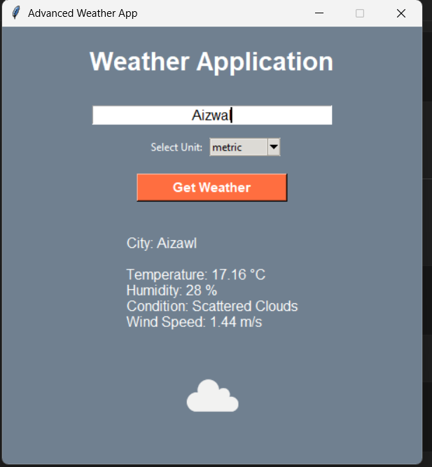

# 🌤 Advanced Weather Application

Developed as part of AICTE Oasis Infobyte Python Development Internship.
Description:
      A GUI-based weather application developed using Python and Tkinter.The application fetches real-time weather data from OpenWeather API and displays temperature, humidity, wind speed, and weather conditions dynamically.

Features:
 -Real-time weather data using OpenWeather API
 -Dynamic background based on weather condition
 -Unit conversion (Celsius / Fahrenheit)
 -Weather icons
 -GUI built with Tkinter
 -Secure API key using .env file Advanced Weather Applicatio
 -Error handling
 -Clean and modern GUI

Technologies Used:
 -Python
 -Tkinter
 -Requests
 -Pillow
 -python-dotenv

Security:
   API key is stored securely using .env file and is not exposed in source code.

How to Run the Project:
  1.Clone the repository
  2.Install dependencies:
            pip install -r requirements.txt
  3.Create a .env file and add:
            API_KEY=your_api_key_here
  4.Run the application:
            python main.py

Internship Project:
    This project was developed as part of the Python Development Internship.

### Application Screenshot:

